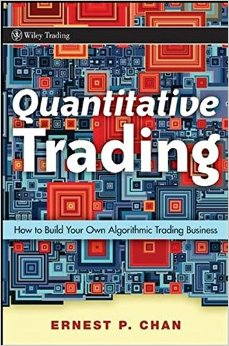

Here are my notes on the book *[Quantitative Trading: How to Build Your Own Algorithmic Trading Business](https://www.amazon.com/Quantitative-Trading-Build-Algorithmic-Business/dp/0470284889/ref=sr_1_1?ie=UTF8&qid=1493239940&sr=8-1&keywords=quant+trading+ernie+chan)* by Dr. Ernie Chan. 

# About This Book

This seems to be the first book by Dr. Ernest Chan on **Quantitative Trading**. It has eight chapters, covering many basics of quantitative trading. Most parts of the book are narratives. Dr. Chan talks about concepts, concerns, and information sources. As someone who has no background in finance or trading, I found his explanation is easy to follow. 

Only a few technical details are concerned in this book, mostly implemented by `matlab`. The tech-heavy chapters are chapter 3 (*backtesting*) and chapter 7 (*special topics in quantitative trading*). Honestly, in my opinion, only chapter 7 can be called technical because it covers some basic strategies.

According to reviews on Amazon, this should be treated as an introductory book. Even for an introduction, as far as I am concerned, this book seems to be too easy. I finished reading this book in three nights for the first pass. I didn't feel it is difficult at all, nor did I feel I have learned what I have expected. That being said, because of its simplicity, I think it is a good and light book to play with some financial ideas, regardless how naive these ideas may be.

Most code in this book is written in `matlab`, and some are used Excel. The survey of `matlab` in the end of thsi book is apparently insufficient for beginners (I am quite fimilar with `matlab`, so I feel OK). I was never a big fan of Excel anyway. So I won't use any of implementations in this book...

Instead,  I will use `python` to re-write all his `matlab` codes.  Nowadays `python` or `R` may be a better candidate to do data analysis. I will change my implementation.  

All `python` codes, together with notes, are written in Jupyter Notebook. I have listed here both original notebooks as well as HTML files generated from those notebooks.

If you are interested in the book, please buy an original copy. I hope I have not unintentionally pirated his book by collecting notes here.

# Notes List

- Chapter 1: [Jupyter Notebook](./notebook/Chapter_1.ipynb), [HTML](./html/Chapter_1.html)
- Chapter 2: [Jupyter Notebook](./notebook/Chapter_2.ipynb), [HTML](./html/Chapter_2.html)
- Chapter 3: [Jupyter Notebook](./notebook/Chapter_3.ipynb), [HTML](./html/Chapter_3.html)
- Chapter 4: [Jupyter Notebook](./notebook/Chapter_4.ipynb), [HTML](./html/Chapter_4.html)
- Chapter 5: [Jupyter Notebook](./notebook/Chapter_5.ipynb), [HTML](./html/Chapter_5.html)
- Chapter 6: [Jupyter Notebook](./notebook/Chapter_6.ipynb), [HTML](./html/Chapter_6.html)
- Chapter 7: [Jupyter Notebook](./notebook/Chapter_7.ipynb), [HTML](./html/Chapter_7.html)
- Chapter 8: [Jupyter Notebook](./notebook/Chapter_8.ipynb), [HTML](./html/Chapter_8.html)

# References

- My Jupyter Notebook Style is adapted from [AeroPython](https://github.com/barbagroup/AeroPython)